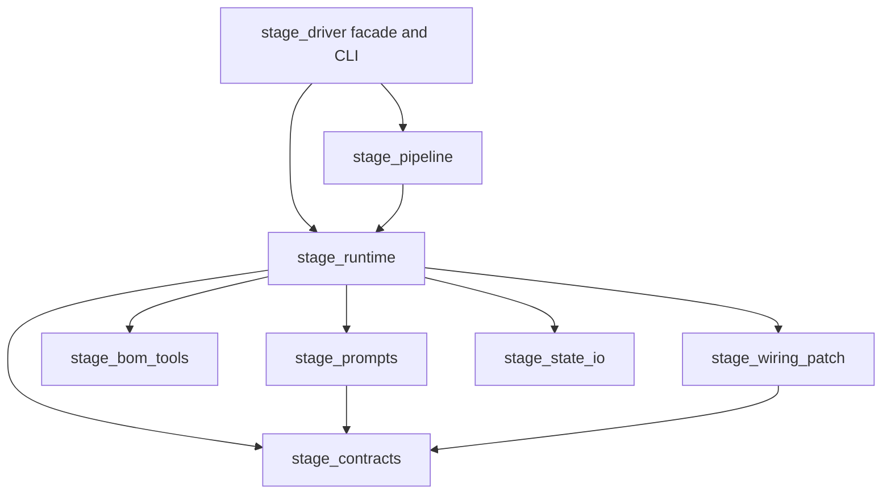

# Stage response-contract repair and stage-driver decomposition

**Status:** implementation-ready plan  
**Source failure:** `KC-ADJ5G9` (`/home/kicraft/.kicraft/projects/1/754`)  
**Scope:** first close the BOM architecture-sheet contract gap, then decompose `kicraft/server/stage_driver.py` without changing stage behavior.

## Decision

Do both changes, in that order:

1. Repair the live correctness boundary in the current implementation. A BOM sheet is a foreign key into the committed architecture, so the provider schema must expose the exact allowed names instead of `type: string`.
2. Freeze that behavior with focused tests.
3. Extract the monolith along existing responsibility seams. Do not combine extraction with policy changes.

The boundary repair is not contingent on the decomposition. It fixes observed terminal failures immediately. The decomposition then makes the next contract, retry, prompt, tool, or telemetry change local instead of forcing edits inside a 2,782-line orchestration module.

## Why this improves KiCraft

### Correctness

- A schema-honoring provider cannot produce `parts[].sheet` or `part_runs[].sheet` values outside the committed architecture.
- The prompt and provider receive one per-invocation schema, eliminating their current independent generation paths.
- Existing §9.13 commit and synthesis checks remain hard boundaries for legacy state, manual edits, provider noncompliance, and regressions.

### Reliability and cost

- The known typo class is prevented during structured decoding instead of consuming a commit-correction attempt.
- A BOM invocation with no usable architecture fails before an LLM call and therefore before spend.
- Retry, serialization-recovery, tool-round, and clean-slate behavior become explicit state transitions rather than interleaved branches. This reduces accidental retry-budget resets and schema drift.

### Maintainability

- Response contracts, prompts, BOM tools, wiring patches, state I/O, and attempt orchestration get single owners.
- Production callers keep one stable `stage_driver` entry surface while internal callers and tests import the module that owns the behavior.
- Future stage-specific work no longer requires loading or modifying unrelated BOM tooling, wiring patching, CLI, replay, telemetry, and prompt code.

### Testability and security

- Pure schema, normalization, retry-classification, and patch functions can be tested without subprocesses or fake provider sessions.
- BOM tool dispatch remains an explicit whitelist in a dedicated module, preserving argv-only execution and making the security boundary easier to audit.
- Provider-call traces can be characterized independently from persistence and telemetry finalization.

### Measurable outcomes

- The frozen BOM typo candidate is excluded by both generated sheet enums; the corrected candidate is included.
- Invalid BOM architecture metadata produces zero fake-client calls and zero recorded provider cost.
- Every full-slot call in a stage invocation carries schema content equal to the contract used in its system prompt.
- Phase 0 provider-call and persistence traces are identical after decomposition, apart from the new BOM enum and prompt rule.
- `stage_driver.py` has no internal-helper consumers in production code and contains none of the prohibited responsibilities listed in Phase 6.
- The mock pipeline commits all design stages and reaches the same deterministic build-tail verdict before and after decomposition.

## Evidence

`KC-ADJ5G9` exhausted its sixth and final BOM attempt with:

- `J3.sheet = "ADDRESSABLE LED OTPUT"`; declared sheet: `ADDRESSABLE LED OUTPUT`
- `C11.sheet = "SPEAKER OTPUT"`; declared sheet: `SPEAKER OUTPUT`

The §9.13 commit gate correctly rejected both values. Offline synthesis of the reconstructed final candidate also rejects them:

```text
synthesis input error: BOM parts reference sheets not in architecture: ['J3', 'C11']
```

The current provider contract is weaker than the committed-state contract:

- `models.BomPart.sheet` is an unconstrained string.
- `BomPartRun.sheet` is an unconstrained string.
- `_schema_for()` and `_stage_response_format()` each call `_response_schema()` independently.
- `_normalize_stage_response()` validates the static Pydantic model, so it does not enforce a run-specific architecture enum.
- §9.13 at commit and the synthesis input guard are the first deterministic architecture-aware checks.

Cross-run evidence found the same unknown-sheet class in designs `1/701`, `1/748`, `1/749`, and `1/754`. Two recovered through retries; two terminated before layout.

## Non-goals

- Do not repair, replay, or hand-edit run `1/754`.
- Do not fuzzy-match, normalize, alias, or autocorrect sheet names.
- Do not weaken the §9.13 commit check, synthesis input check, or emitter assertion.
- Do not change architecture generation, provider selection, retry counts, token budgets, BOM tool budgets, part resolution, wiring semantics, or layout.
- Do not introduce a stage plugin framework, dependency-injection container, async orchestration, or a class hierarchy for five fixed design stages.
- Do not split `client.py`, `session.py`, the web server, or the design CLI as collateral work.
- Do not add a production JSON-schema validator solely for this repair.

## Target boundaries

The final dependency direction is one-way:



No extracted module may import `stage_driver`. `stage_runtime` is the integration owner. Leaf modules must not call provider clients or mutate durable state unless that responsibility is explicitly theirs.

### `kicraft/server/stage_contracts.py`

Own:

- stage response Pydantic models;
- compact BOM run expansion;
- JSON-schema composition;
- the per-invocation `StageResponseContract`;
- response parsing and Pydantic normalization;
- response-format construction.

Do not own prompts, provider calls, retries, commits, or telemetry.

### `kicraft/server/stage_prompts.py`

Own:

- stage specification loading;
- system-prompt assembly;
- stage-specific prompt rules;
- worked examples;
- collection-bound rendering;
- core-default prompt formatting;
- brief-derived BOM hints.

Accept a completed `StageResponseContract`; never regenerate a schema.

### `kicraft/server/stage_bom_tools.py`

Own:

- `BOM_TOOLS`;
- BOM executor construction;
- MPN normalization and per-MPN query caps;
- read-only lookup memoization;
- fetched-bundle result reduction.

Retain fixed argv construction, the tool whitelist, and the existing per-stage executor lifetime.

### `kicraft/server/stage_wiring_patch.py`

Own:

- patch operation models and response format;
- canonical wiring representation;
- patch constraints;
- patch application and stale-precondition checks;
- patch-specific retry messages.

Do not own the outer retry loop or commits.

### `kicraft/server/stage_state_io.py`

Own:

- the `KICRAFT` design-CLI command prefix and subprocess runner;
- stage preparation;
- commit invocation;
- durable stage-status stamping;
- question attachment;
- committed-BOM reference reads.

All subprocess calls remain argv lists. All state writes remain atomic.

### `kicraft/server/stage_runtime.py`

Own:

- preparation of one immutable stage invocation;
- provider-call execution;
- retry and recovery transitions;
- candidate/question/failure outcome classification;
- commit-correction orchestration;
- stage result and telemetry finalization.

It consumes contracts, prompts, tools, patches, and state I/O through ordinary functions. It must not contain large prompt literals, Pydantic model declarations, tool command tables, or wiring patch algorithms.

### `kicraft/server/stage_pipeline.py`

Own:

- stage-chain sequencing;
- replay workspace setup;
- per-run budget wrapper and client construction;
- full design-stage pipeline sequencing.

### `kicraft/server/stage_driver.py`

Remain the stable public entry surface:

- `DESIGN_STAGES`;
- `drive_stage`;
- `drive_chain`;
- `run_pipeline`;
- `drive_replay`;
- `make_budget_client`;
- command-line parsing and command handlers.

It may import and expose these owned entry points, but it must contain no duplicated implementation. Production code that needs an internal helper must import that helper from its owner, not through `stage_driver`.

## Phase 0: characterize the live behavior

Before moving code, add only missing behavioral coverage needed to freeze the seams touched below.

### Provider-call trace

For a scripted fake client, record:

- system and user messages;
- tools and tool choice behavior;
- response-format content;
- max tokens, temperature, reasoning, and collection bounds;
- call count and attempt metadata;
- serialization-recovery and commit-correction calls.

Cover:

1. ordinary successful stage;
2. BOM tool use followed by a forced schema-bound final response;
3. invalid JSON followed by serialization recovery;
4. commit rejection followed by preserving correction;
5. repeated rejection followed by one clean-slate correction;
6. blocking question;
7. transport/provider terminal failure;
8. wiring patch correction.

Assert observable calls and returned stage results, not source layout or private implementation order.

### Persistence trace

Freeze:

- successful and failed `stage_status`;
- question attachment;
- ledger fields;
- `attempts`, `rounds`, `tool_calls`, wall/CPU fields, and failure kinds;
- no provider call after failed stage preparation.

Do not duplicate contracts already covered by existing retry, status, telemetry, replay, BOM-budget, and prompt tests.

## Phase 1: precise BOM response-contract repair

Implement this phase in the current module first. It must be independently releasable.

### 1. Build a per-invocation contract

Add a small frozen `StageResponseContract` value with:

- `stage`;
- the completed JSON-schema dictionary;
- the strict provider `response_format` wrapping that exact dictionary.

`build_stage_response_contract(stage, prompt_state)` must:

1. generate a fresh stage schema;
2. for non-BOM stages, preserve the current schema content;
3. for BOM, extract architecture sheet names from `prompt_state["architecture"]["sheets"]`;
4. preserve architecture order;
5. require at least one nonempty string name;
6. reject duplicates and malformed structures;
7. add the exact enum to both `$defs.BomPart.properties.sheet` and `$defs.BomPartRun.properties.sheet`;
8. fail closed if either expected generated-schema node is absent;
9. build `response_format` with the same schema object.

The strict extraction checks are invariant checks. `stage-prep` already validates normal persisted architecture state; these checks prevent an unconstrained provider call if that upstream contract changes or is bypassed.

### 2. Use the contract once

Inside `drive_stage()`:

1. run stage preparation;
2. construct `prompt_state`;
3. build one `StageResponseContract`;
4. pass it to `build_system()` for schema serialization;
5. pass its `response_format` to every normal, forced-final, serialization-recovery, and commit-correction provider call.

`build_system()` must accept a completed contract and must not call `_response_schema()`. The response-format path must not regenerate the schema.

For wiring patch mode, the explicitly different wiring-patch contract remains local to that mode.

### 3. Add the behavioral prompt rule

Add adjacent to the BOM output-shape rules:

```text
- SHEET NAMES ARE CLOSED: every parts[].sheet and part_runs[].sheet must copy one architecture.sheets[].name verbatim; never abbreviate, correct, or invent a sheet name.
```

The enum is authoritative. This prose only assists providers or models that incompletely honor structured-output constraints.

### 4. Keep deterministic guards

Leave unchanged:

- `check_bom_parts_reference_architecture_sheets()`;
- synthesis unknown-sheet rejection;
- emitter unknown-sheet assertion.

The provider contract is preventive. The existing guards remain authoritative for bypassed or persisted invalid state.

### 5. Focused verification

Tests must prove:

1. a BOM contract built from `("ADDRESSABLE LED OUTPUT", "SPEAKER OUTPUT")` exposes exactly that enum on both sheet-bearing definitions;
2. `response_format["json_schema"]["schema"]` is the contract's schema object, and the schema JSON embedded in the prompt deserializes to equal content;
3. question responses remain the unchanged second `anyOf` branch;
4. non-BOM schema content is unchanged;
5. missing, empty, duplicate, and malformed BOM architecture data fails before the fake client is called;
6. normal BOM, forced-final, serialization-recovery, and commit-correction calls reuse the original contract;
7. compact `part_runs` still expand when their sheet is allowed;
8. §9.13 and synthesis still reject schema-bypassed invalid state.

Be exact about the guarantee: KiCraft sends a closed enum to schema-honoring providers. KiCraft does not locally execute arbitrary JSON Schema before Pydantic normalization. Do not claim that `_normalize_stage_response()` itself rejects the typo.

For the frozen candidate:

1. reconstruct it in a temporary directory without modifying the source run;
2. assert that both typo values are absent from the generated enum;
3. assert that replacing only those values with the committed names satisfies the sheet portion of the contract;
4. run offline synthesis on the corrected temporary state and require it to advance beyond the unknown-sheet input check.

## Phase 2: extract contracts and prompts

This is the first behavior-preserving decomposition.

1. Move response models, compact BOM expansion, schema composition, `StageResponseContract`, JSON extraction, and normalization to `stage_contracts.py`.
2. Move specification loading, stage rules, examples, bounds text, core-default formatting, and system-prompt assembly to `stage_prompts.py`.
3. Make prompt construction require a completed contract.
4. Move tests to import each helper from its owning module.
5. Keep only the public runtime entry points exposed by `stage_driver`.

Check:

- Phase 0 provider-call traces are unchanged.
- Prompt examples remain model-valid.
- Non-BOM prompt and response-schema snapshots are content-equivalent.
- Contract and prompt modules import without server settings, network, subprocess, or state writes.

Improvement delivered: schema and prompt changes become pure, local, and independently testable; prompt/provider drift becomes structurally difficult.

## Phase 3: extract BOM tools and wiring patches

These are independent leaf extractions and may be implemented in separate commits.

### BOM tools

1. Move tool declarations and executor helpers to `stage_bom_tools.py`.
2. Inject the existing subprocess runner rather than importing `stage_driver`.
3. Preserve one executor instance per BOM stage invocation so memoization and resolution ledgers survive retries exactly as today.
4. Migrate BOM-budget and prompt-injection tests to the new owner.

### Wiring patches

1. Move patch models, schema, constraints, canonicalization, messages, and application to `stage_wiring_patch.py`.
2. Expose one patch-contract constructor and pure patch application function.
3. Preserve the current switch to patch mode, repeated-rejection clean slate, and stale-precondition failure behavior.
4. Migrate patch tests to the new owner.

Check:

- tool names, descriptions, argv, query caps, memoization, and round budgets are unchanged;
- security tests still prove unknown tools cannot dispatch and untrusted arguments never enter a shell;
- wiring patch operations and provider-call traces are unchanged.

Improvement delivered: high-risk external tool dispatch and wiring mutation logic become isolated audit surfaces.

## Phase 4: extract state I/O and finalization

1. Move design-CLI subprocess execution, stage prep, commit, status stamping, question attachment, and committed-BOM reads to `stage_state_io.py`.
2. Replace `session.py` imports of private `stage_driver` helpers with imports from `stage_state_io`.
3. Move ledger/status result assembly behind small finalization functions that accept explicit measurements and outcome data.
4. Keep stage preparation and commit as subprocess boundaries; do not rewrite them into in-process design-model calls during this extraction.

Check:

- stage-prep failures still make zero provider calls and record zero cost;
- atomic writes and existing state preservation remain unchanged;
- manual stage edits through `session.py` still use the same commit and status path;
- telemetry tests retain the same fields and values.

Improvement delivered: durable-state mutation and subprocess behavior have one owner, reducing partial-write and telemetry divergence risk.

## Phase 5: make retry orchestration an explicit state machine

Only after all leaf behavior is frozen and extracted, move `drive_stage()` into `stage_runtime.py`.

Use boring data structures:

- frozen `PreparedStage`: prompt state, extras, base messages, contract, policy, tools, executor;
- mutable `AttemptState`: attempts, retry counters, messages, reasoning, temperature, prior rejection signature, wiring candidate/patch state;
- tagged `AttemptOutcome`: `candidate`, `questions`, `recoverable_failure`, or `terminal_failure`.

Split the loop into functions with one responsibility:

1. `prepare_stage_invocation()` performs prep, prompt-state projection, contract creation, prompt construction, and immutable policy resolution.
2. `call_stage_provider()` makes exactly one normal or tool-enabled provider call and returns raw provider facts.
3. `decode_stage_response()` classifies reasoning loops, collection limits, JSON failures, schema failures, questions, and candidates without committing.
4. `run_serialization_recovery()` performs at most the configured tool-free recovery call using the original contract.
5. `commit_candidate()` commits once and returns the deterministic rejection or success.
6. `next_attempt()` applies the existing retry, preserving-correction, clean-slate, and wiring-patch transitions.
7. `finalize_stage()` records status, ledger data, progress, and the caller-visible result once.

Invariants:

- only `call_stage_provider()` and `run_serialization_recovery()` call the client;
- every provider call increments `attempts` exactly once;
- provider-call budget, serialization budget, and reasoning-loop budget are independent and never reset;
- all full-slot calls use the prepared stage contract;
- retries start from pristine base messages plus only the required prior answer/feedback;
- one terminal path finalizes failure; one success path finalizes success;
- a blocking question parks without commit;
- no outcome is labeled `invalid_json` when the durable failure kind is transport, provider, reasoning loop, collection limit, schema rejection, or commit rejection.

Check all Phase 0 traces. Add tests only for a transition that was previously unobservable or uncovered; do not assert helper call order.

Improvement delivered: retry correctness becomes reviewable as transitions and budgets rather than emergent control flow inside one large function.

## Phase 6: extract pipeline and reduce the facade

1. Move chain sequencing, replay, budget-client construction, and full-pipeline sequencing to `stage_pipeline.py`.
2. Migrate `session.py`, load tests, and web callers to the intended public entry points.
3. Keep `stage_driver.py` as the stable facade and CLI only.
4. Remove obsolete private re-exports and update tests to import internal helpers from their owners.
5. Delete dead comments whose incident history no longer explains code in their new module; retain comments that document an invariant or non-obvious policy.

Final structural checks:

- `stage_driver.py` contains no response models, prompt bodies, BOM tool table, tool executor, wiring patch algorithm, state-write implementation, or retry-state internals;
- no extracted module imports `stage_driver`;
- production modules do not import underscore-prefixed helpers from `stage_driver`;
- `drive_stage()` reads as orchestration and contains no subprocess argv construction, JSON-schema mutation, or prompt policy literals;
- the CLI and existing production import surface continue to work.

Improvement delivered: `stage_driver` becomes a comprehensible entry point rather than the owner of every stage concern.

## Verification matrix

Run focused verification after each phase, then the combined suite once after Phase 6.

### Boundary repair

```bash
.venv/bin/python -m pytest -q \
  tests/test_stage_driver_prompt_examples.py \
  tests/test_stage_driver_retry.py \
  tests/test_kicraft_stage_cli.py::test_stage_commit_bom_rejects_unknown_architecture_sheet \
  tests/test_kicraft_synthesis.py::test_synthesis_bom_references_unknown_sheet_raises
```

### Leaf extraction

```bash
.venv/bin/python -m pytest -q \
  tests/test_stage_driver_core_defaults.py \
  tests/test_bom_search_budget.py \
  tests/security/test_prompt_injection.py
```

### Runtime and state extraction

```bash
.venv/bin/python -m pytest -q \
  tests/test_stage_driver_retry.py \
  tests/test_stage_driver_replay.py \
  tests/test_stage_resource_telemetry.py \
  tests/test_stage_status.py
```

### Final smoke test

Run the load-test mock pipeline through all `DESIGN_STAGES`. Require:

- every stage commits;
- the emitted provider-call trace uses the expected contract for every full-slot call;
- BOM tool rounds remain bounded;
- the deterministic build tail reaches the same result as before decomposition.

No live LLM call is required for decomposition verification. For the boundary repair, provider compatibility remains covered by the existing structured-output preflight; the frozen candidate proves the exact new enum.

## Acceptance criteria

### Boundary repair

- Every BOM provider contract carries the exact committed architecture sheet enum on both `parts` and `part_runs`.
- Prompt and provider response format derive from one `StageResponseContract`.
- Invalid or absent architecture sheet metadata fails before spend.
- Questions and non-BOM contracts are unchanged.
- Commit, synthesis, and emitter defenses remain active.
- The frozen typo candidate is outside the generated enum; correcting only the two names passes that contract portion and advances synthesis beyond the original failure.

### Decomposition

- Existing observable stage behavior, budgets, prompts, provider parameters, retries, results, persistence, and telemetry remain unchanged except for the boundary repair.
- Each responsibility has the owner defined above and dependencies remain acyclic.
- `stage_driver.py` is a facade/CLI, not another copy of the runtime.
- Internal production callers and tests no longer reach private helpers through `stage_driver`.
- Tool dispatch security properties and atomic state writes remain intact.
- The mock full-stage pipeline and focused suites pass.

## Risks and controls

- **Large refactor hides behavior changes:** land the boundary repair first; extract one leaf responsibility per commit; prohibit policy changes during Phases 2–6.
- **Circular imports:** enforce the target dependency direction and prohibit imports of `stage_driver` from extracted modules.
- **Schema cache leakage:** mutate only a fresh generated schema and keep the contract invocation-scoped.
- **Prompt/provider drift:** prompts accept a completed contract and cannot construct one.
- **Provider ignores enums:** retain the explicit prompt rule and deterministic §9.13/synthesis guards; scope claims to schema-honoring providers.
- **Retry budget regression:** freeze provider-call traces and model each budget as a distinct `AttemptState` field.
- **Executor cache regression:** retain one BOM executor per prepared invocation.
- **Telemetry double-write or omission:** centralize finalization and test every terminal outcome.
- **Security regression during tool extraction:** preserve the whitelist and argv-only subprocess tests before moving orchestration.
- **Facade becomes a compatibility junk drawer:** expose only the documented public entry points; migrate all private-helper consumers to their owners.

## Completion standard

The work is complete only when the precise BOM contract repair is independently verified, the monolith has been decomposed along the stated boundaries, all production/test imports are migrated, the mock pipeline exercises the real stage runtime end to end, and no obsolete implementation remains in `stage_driver.py`.